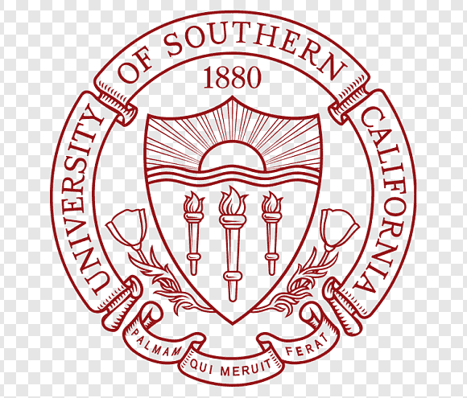
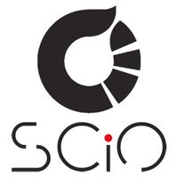



 View in  

<table>
  <tr>
    <th colspan=2> Education </th>
  </tr>
  <tr>
    <td></td>
    <td><b>University of Southern California</b>, Los Angeles, CA, U.S.A.  
      <i>Ph.D.</i> in <i>Computer Science</i>  
      August 2021 -- Present  
      <i>Advisor</i>: <a href="https://sail.usc.edu/people/shri.html" target="_blank">Prof. Shri Narayanan</a>
    </td>
  </tr>
  <tr>
    <td></td>
    <td><b>University of Southern California</b>, Los Angeles, CA, U.S.A.  
      <i>M.Sc.</i> in <i>Computer Science</i>  
      August 2021 -- Present  
      <i>Current GPA</i>: <b>4.0</b> / 4.0  
    </td>
  </tr>
  <tr>
    <td></td>
    <td><b>National Technical University of Athens</b>, Athens, Greece   
      <i>Joint B.Sc. & M.Eng.</i> in <i>Electrical & Computer Engineering</i>  
      September 2015 -- October 2020 (5yrs)  
      <i>Major</i>: Computer Science  
      <i>Cumulative GPA</i>: <b>9.56</b> / 10  
      <i>Thesis</i>: <a href="https://dspace.lib.ntua.gr/xmlui/bitstream/handle/123456789/52318/chochlakis_thesis.pdf?sequence=4&isAllowed=y" target="_blank"> Using Artificial Neural Networks for Zero-shot Learning </a>  
      <i>Advisor</i>: <a href="https://slp.cs.ece.ntua.gr/potam/index.html" target="_blank">Prof. Alexandros Potamianos</a>
    </td>
  </tr>
</table>

<table>
  <tr>
    <th colspan=2> Work Experience </th>
  </tr>
  <tr>
    <td></td>
    <td><b>Behavioral Signal Technologies</b>, Los Angeles, CA, U.S.A.  
      <i>Machine Learning engineer</i>  
      December 2020 -- July 2021 (6mos) 
      <i>Duties</i>: Speech Diarization in phone calls, Feature engineering and modeling of speakers in phone calls  
    </td>
  </tr>
  <tr>
    <td></td>
    <td><b>SCiO P.C.</b>, Athens, Greece  
      <i>Machine Learning intern</i>  
      July 2019 -- August 2019 (2mos)  
      <i>Duties</i>: Feature Engineering and Predictive Modeling for rice production in India  
      <i>Body of Work</i>: <a href="https://github.com/SCiO-systems/india-rice-production-igc" target="_blank">code</a>  
      <i>Supervisor</i>: <a href="https://scio.systems/pythagoras/" target="_blank">Dr. Pythagoras Karampiperis</a>
    </td>
  </tr>
</table>

<table>
  <tr>
    <th colspan=2> Research Experience </th>
  </tr>
  <tr>
    <td></td>
    <td><b>University of Southern California</b>, Los Angeles, CA, U.S.A.  
      <i>Graduate Research Assistant</i> at the <i><a href="https://sail.usc.edu/" target="_blank">Signal Analysis and Interpretation Lab</a></i>  
      May 2021 -- Present  
      <i>Duties</i>: Multilingual & Multimodal Affective Analysis on Social Media | Resurrected and running the reading group of the lab with 15-20 active members | Actively mentoring 2 undergraduate and 1 graduate students (currently at Microsoft) | IEEE K-12 Outreach programs: Presented in Spring 22 campus visit to approx. 90 students, *Team Lead* in Fall 22 campus visit for approx. 80 students
       
      <i>Advisor</i>: <a href="https://sail.usc.edu/people/shri.html" target="_blank">Prof. Shri Narayanan</a>
    </td>
  </tr>
  <tr>
    <td></td>
    <td><b>National Technical University of Athens</b>, Athens, Greece   
      <i>Undergraduate Research assistant</i> at the <i>Speech and Language Processing group</i>  
      March 2020 -- November 2020 (9mos)  
      <i>Duties</i>: Sample-efficient Learning research  
      <i>Body of Work</i>: paper (<a href="https://arxiv.org/pdf/2102.04379.pdf" target="_blank">preprint</a>) with <a href="https://github.com/gchochla/z2fsl" target="_blank">code</a>  
      <i>Advisor</i>: <a href="https://slp.cs.ece.ntua.gr/potam/index.html" target="_blank">Prof. Alexandros Potamianos</a>
    </td>
  </tr>
  <tr>
    <td></td>
    <td><b>Demokritos National Center for Scientific Research</b>, Athens, Greece  
      <i>Research intern</i> at the <i>Institute of Informatics & Telecommunications</i>  
      October 2019 -- June 2020 (9mos)  
      <i>Duties</i>: Remote Sensing applications of Computer Vision and Deep Learning  
      <i>Body of Work</i>: <a href="https://www.mdpi.com/2072-4292/12/12/2002" target="_blank">paper</a> with <a href="https://github.com/Panagiotou/ImageToDEM" target="_blank">code</a>  
      <i>Advisor</i>: <a href="https://users.iit.demokritos.gr/~exarou/" target="_blank">Dr. Eleni Charou</a>
    </td>
  </tr>
</table>

<table>
  <tr>
    <th colspan=2> Awards </th>
  </tr>
  <tr>
    <td></td>
    <td><b>National Technical University of Athens</b>, Athens, Greece   
      <i>Highest GPA in school of ECE</i>, Thomaidis Foundation Grant
    </td>
  </tr>
  <tr>
    <td></td>
    <td><b>National Technical University of Athens</b>, Athens, Greece   
      <i>Publication Award</i>, Thomaidis Foundation Grant
    </td>
  </tr>
</table>

<table>
  <tr><th> Publications </th></tr>
   
    <tr><td></td></tr>
  
</table>

Languages
------
🇬🇷 Greek (Native), 🇬🇧 🇺🇸 English (Fluent), 🇫🇷 French (Paris-Sorbonne C1), 🇪🇸 Spanish (Elementary)

Skills
------
* Programming Languages: Now mostly 🐍 Python, but have worked with 🇨 C/C++, ♨️ Java, 🇯🇸 JavaScript, 🐬 SQL
* Frameworks: 🔥 PyTorch and the likes (NumPy, ...)

Miscellaneous
-----
* Sports  ⚽ 🏀 👟

* Books 📖 -> popular science🥼  AI🤖  history📜  philosophy💭  crime🔫

* Video Games (sorta)  🐭⚡ ⚽ 🏀 ...
